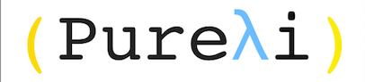

Pureli Manual
=============




Introduction
============

Pureli is a purely functional, dynamically typed, parallel evaluated, lisp-like programming language.
These are all very big words, so let's analyze them one by one:

- **Pure**: in Pureli, everything is immutable. Variables do not vary and it is not possible to destructively update data structures. Side Effects such as input and output are explicitly controlled by the programmer and can only happen in specific places.
- **Functional**: Pureli follows the functional programming paradigm. In Pureli there are no loops or classes, there are recursion, modules and higher order functions.
- **Dynamically Typed**: In Pureli, the types of values are checked at runtime. This makes code like this: `(if #t 1 "hello")` possible to run.
- **Parallel Evaluated**: In Pureli, arguments to functions in pure context can be evaluated (run) in parallel automatically.
- **Lisp-like**: Pureli's syntax is inherited from the long tradition of the LiSP familly of programming languages.

We will continue to explore these qualities that makes Pureli interesting and unique in future chapters.

Out of the Frying Pan and into the Fire
---------------------------------------

Lets start by learning about Pureli's Atomic Expressions.

Atomic Expressions
------------------

Atomic expressions are expressions that cannot be evaluated any further. In Pureli, you can find:

- **Integers**: Arbitrarily big integers such as (`123`, `0`, `-55192293384175798123471`)
- **Reals**: Double-precision floating point numbers such as (`12.0`, `-51.5`, `0.01432`)
- **Booleans**: Boolean values: `#t` for true, `#f` for false. In Pureli every value other than `#f` is `#t`.
- **Strings**: Text strings such as (`"Hello world!"`, `"Pureλi is Great!"`)
- **Symbols**: Symbols are used as names for values and functions. (`x`, `lines->str`, `print!`) are symbols that evaluates to variables and functions.
- **Keywords**: Keywords are like Symbols, only that they always evaluated to themselves. They are useful for passing flags to functions or as keys for a dictionary. (`:hello`, `:x`, `:always-start-with-colons`)
- **Nil**: Nil is like `void`, `Unit` or `()` in other languages. (`nil`, `()`)


Syntax
------


Pureli derives it's syntax from LiSP, a family of programming languages with similar syntax and attributes.

LiSP, as it's name, is about List Processing. In lisp, everything is either an atomic expression or a list,
which is denoted by parenthesis.

For example:
```rkt
(this is a list)
```

Lists can be nested:
```rkt
(this is a (list inside (a list)))
```

Lisp uses polish notation. When evaluated, the first argument serves as a command and the rests are arguments:
```rkt
(+ 32 1 942 444)
```

Expressions can be nested as well:
```rkt
(+ 32 1 942 (+ 111 222 1 110))
```

To stop an expressions from evaluating we use the command `quote`:
```rkt
(quote (+ 2 2 3)) ;; => '(+ 2 2 3)
```

It's result will be a data structure with these arguments, which can be evaluated using `eval`.
```rkt
(eval (quote (+ 2 2 3))) ;; => 7
```

Since the result of `quote` expression is a data structure, a list, we can use list operations such as
`car`, `cdr`, and `++` to manipulate it:
```rkt
(eval (++ '(*) (cdr (quote (+ 2 2 3))))) ;; => 12
```

**In Pureli (and Lisp), code __is__ data!**


Defining Things
---------------

We use `define` to bind names to expressions:
```rkt
(define x (+ 1 2 3))
```

We can create our own anonymous functions using `lambda`:

```rkt
((lambda (x y) (+ x y)) 2 3) ;; => 5
```

If we want to create a function and give it a name, we can use `define`:

```rkt
(define f
  (lambda (x y) (+ x y)))
```

Or use another form of `define` which is just a syntactic sugar:
```rkt
(define f (x y)
  (+ x y))
```

`define` can only be used to introduce a name at the top level of a module, which will make it available to the entire module.

For local definitions, We can use `let` and `letrec`:
```rkt
(let ([x 5] [y 1]) (+ x y)) ;; => 6

(letrec ([loop (lambda () (loop))]) (loop)) ;; => <infinite-loop>

(let ([loop (lambda () (loop))]) (loop)) ;; => error. cannot find x in environment
```


### Unevaluated parameters

It is also possible to define functions with receives unevaluated parameters

```rkt

(module main)

(define first-element (~x)
  (eval (car 'x)))

  (first-element (:hello (error "will not be thrown"))) ;; => :hello

```

Functions with Unevaluated parameters are useful when we want to expand the language
and are Pureli's alternative for simple macros.


Modules
-------

### Definition

It is possible to define multiple modules per file. In order to run a file, a 'main' module must be present.

Syntax: `(module <name> ?(<exported definitions>))`

- `(<exported definitions>)` will only export definitions listed. Optional.


### Requires

It is possible to import a source file using the `require` keyword at the top of the module. Cyclic imports are currently not allowed.

Syntax: `(require <filepath> <module name> ?(<imported definitions>) <?new name>)`

Or when required module is in the same file: `(module <name>)`

- `(<imported definitions>)` will only imported definitions listed. Optional.
- `<new name>` will give the module a new name. Optional.
- A definition from a module can be accessed using `/`.


I/O
---

I/O handling in Pureli might be a bit different from what you are used to.
Since most functions in pureli are pure, the cannot have side-effects.
This means that you need to separate pure computations from impure computations in your code, this is how you do it:

- The entry point, `main` in the module `main`, starts as impure
- Chaining impure actions are done with `do!`
- Lifting a pure computation into impure context is done with `pure`
- `let!` is used to bind a result from impure context to a name

Example:

```rkt

(module main)

(define main
  (do!
    (print! "calculating the sum of 1, 2 and 3:") ;; print! is impure
    (let! result (pure (+ 1 2 3))) ;; pure lifts (+ 1 2 3) into impure context and let! binds it to result
    (print! result))) ;; print! prints the result

```

This separation is useful for a number of things:

- Separating concerns
- Safety from state changes
- Modularity
- Testability
- Freedom to parallelize!


Built-in Procedures
-------------------

- Arithmetic operations (`+`, `-`, `*`, `/`, `mod`)
- Tests (`zero?`, `empty?`, `nil?`, `number?`, `integer?`, `real?`, `list?`. `string?`, `procedure?`, `symbol?`, `keyword?`)
- Comparison (`=`, `<>`, `>`, `<`, `>=`, `<=`)
- List operations (`list`, `car`, `cdr`)
- List and String operations (`++`, `slice`, `length`)
- String operations (`str->lines`, `str->words`, `lines->str`, `words->str`, `to-upper`, `to-lower`)
- `round` operation on reals
- `show` expression
- `if` expression
- `let` and `letrec`
- `quote`, `eval` and `read-str`
- `error`, `try` and `trace`
- `lambda` expression

### Built-in IO Actions

- `do!` sequence IO actions
- `let!` binds an IO result to a variable
- `read!` reads a line from the standard input
- `read-file!` reads a file
- `print!` writes a line to the standard output
- `print-file!` writes a string to a file
- `pure` raises a pure computation into IO context

Standard Library Modules
------------------------

- `std`
- `list`
- `bool`
- `numbers`
- `dict`

Use `(require "stdlib/std.pli" <module-name>)` to import modules from the standard library.
