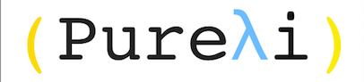

Pureli Manual
=============

Introduction
============

Pureli is a purely functional, dynamically typed, parallel evaluated, lisp-like programming language.
These are all very big words, so let's analyze them one by one:

- **Pure**: in Pureli, everything is immutable. Variables do not vary and it is not possible to destructively update data structures. Side Effects such as input and output are explicitly controlled by the programmer and can only happen in specific places.
- ***Functional**: Pureli follows the functional programming paradigm. In Pureli there are no loops or classes, there are recursion, modules and higher order functions.
- **Dynamically Typed**: In Pureli, the types of values are checked at runtime. This makes code like this: `(if #t 1 "hello")` possible to run.
- **Parallel Evaluated**: In Pureli, arguments to functions in pure context can be evaluated (run) in parallel automatically.
- **Lisp-like**: Pureli's syntax is inherited from the long tradition of the LiSP familly of programming languages.

We will continue to explore these qualities that makes Pureli interesting and unique in future chapters.

From the Frying Pan and into the Fire
-------------------------------------

Lets start by learning about Pureli's Atomic Expressions.

Atomic Expressions
------------------

Atomic expressions are expressions that cannot be evaluated any further. In Pureli, you can find:

- **Integers**: Arbitrarily big integers such as (`123`, `0`, `-55192293384175798123471`)
- **Reals**: Double-precision floating point numbers such as (`12.0`, `-51.5`, `0.01432`)
- **Booleans**: Boolean values: `#t` for true, `#f` for false. In Pureli every value other than `#f` is `#t`.
- **Strings**: Text strings such as (`"Hello world!"`, `"Pureλi is Great!"`)
- **Symbols**: Symbols are used as names for values and functions. (`x`, `lines->str`, `print!`) are symbols that evaluates to variables and functions.
- **Keywords**: Keywords are like Symbols, only that they always evaluated to themselves. They are useful for passing flags to functions or as keys for a dictionary. (`:hello`, `:x`, `:always-start-with-colons`)
- **Nil**: Nil is like `void`, `Unit` or `()` in other languages. (`nil`, `()`)

Syntax
------

`TODO`

Built-in Procedures
-------------------

- Arithmetic operations (`+`, `-`, `*`, `/`, `mod`)
-------------------
All the arithmetic operation will be used as in polish style. The operator will be written first and than the arguments.

example:

if we would like to use the expression `x+y` it will be written as:

`(+ x y)`

if we would like to use the expression `x-y` it will be written as:

`(- x y)`

if we would like to use the expression `x*y` it will be written as:

`(* x y)`

if we would like to use the expression `x/y` it will be written as:

`(/ x y)`

if we would like to use the expression `x%y` (modulu operation) it will be written as:

`(mod x y)`

You may use more than two argument . for example:

`(+ x y z)` = `x+y+z`

See maunal_tests/arithmetic.pli

- Test (`zero?`, `empty?`, `nil?`, `number?`, `integer?`, `real?`, `list?`. `string?`, `procedure?`, `symbol?`, `keyword?`)
-------------------

Test operation will give you information about the state of an expression:

`zero?` - to check if an expression `x` is zero, use : `(zero? x)`

`empty?` - to check if a data structure `x` is empty, use : `(empty? x)`

`nil?` - to check if an expression `x` is nil(null), use : `(nil? x)`

`number?` - to check if an expression `x` is a number, use : `(number? x)`

`integer?` - to check if an expression `x` is an integer, use : `(integer? x)`

`real?` - to check if an expression `x` is an real number, use : `(real? x)`

`list?` - to check if an expression `x` is a list, use : `(list? x)`

`string?` - to check if an expression `x` is a string, use : `(string? x)`

`procedure?` - to check if an expression `x` is a procedure, use : `(procedure? x)`

`symbol?` - to check if an expression `x` is a symbol, use : `(symbol? x)`

`keyword?` - to check if an expression `x` is a keyword, use : `(keyword? x)`

See maunal_tests/tests.pli

- Comparison (`=`, `<>`, `>`, `<`, `>=`, `<=`)
-------------------

Comparison operations are used to compare between expressions:

`=` - to check if two expressions `x` and `y` are equal , use : `(= x y)`

`<>` - to check if two expressions `x` and `y` are not equal , use : `(<> x y)`

`>` - to check if `x > y`, use : `(> x y)`

`<` - to check if `x < y`, use : `(< x y)`

`>=` - to check if `x >= y`, use : `(>= x y)`

`<=` - to check if `x <= y`, use : `(<= x y)`

See maunal_tests/comparison.pli

- List operations (`list`, `car`, `cdr`)
-------------------

List operations are used to create and manipulate a list:

`list` - to create a list and initialize it with the expressions , `x` , `y` and `z` use: `(list x y z)`

`car` - to get the first member (alse called head) of the list, `lst` use : `(car lst)`

`car` - to get the first member (alse called tail) of the list, `lst` use : `(cdr lst)`

See maunal_tests/list_operations.pli

- List and String operations (`++`, `slice`, `length`)
-------------------

List and String operations are also used to manipulate a list and get info on it:

`++` - to append list `lst1` to `lst2` use : `(++ lst1 lst2)`

`slice` - to slice list `lst` from `i` place to `j` place use : `(slice i j lst)`

`length` - to get the length of `lst` use : `(length lst)`

You may do the same for strings.

See maunal_tests/list_string_operations.pli

